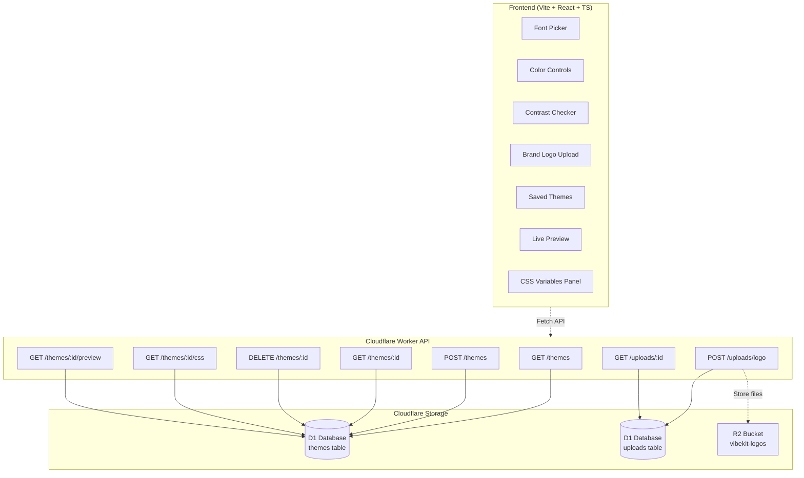

# VibeKit

## About VibeKit

VibeKit is a theme-design toolkit that lets you craft and share UI tokens — **colors**, **typography**, and **spacing** — with a live preview and a shareable CSS endpoint you can drop into any frontend. The app includes a **Google Fonts picker**, **contrast checker (WCAG)**, and a **public preview** page.

## Project Origins

> VibeKit began as a "vibe-coding" experiment during the **Girls Develop It: Fearless UX: Unleash Your Creative Potential** design workshop. I learned about Vibe Coding from [**Piyush Acharya**](https://github.com/VerisimilitudeX) at **Git Merge 2025**. The project was built in collaboration with [**Krystina Bradley**](https://github.com/kscott2016), who helped shape the user-empathy work, journey mapping, and prototyping. This project was coded with **ChatGPT** and **GitHub Copilot**. – Cloudflare Monorepo (Pages + Worker)

### Highlights

- **Inline Live Preview (editor):** See changes instantly on the main page driven by your neutral tokens.
- **Google Fonts:** Pick separate **Header** and **Paragraph** families and weights. Optional full catalog + search via `VITE_GF_API_KEY`.
- **Color Tokens:** Neutral, Primary, Secondary, Tertiary, Danger, Warning, Caution, Success. All exported as CSS variables.
- **Contrast Checker:** Quick AA/AAA checks for key pairs.
- **Palette Generator:** Get triadic/analogous/complementary suggestions from a seed color and apply with one click.
- **Logos:** **upload your own** (PNG/SVG/JPEG/WebP) — stored in **R2** and served via `/api/assets/*`.
- **Shareable:** `/api/themes/{id}.css` (1‑day cache) and `/api/themes/{id}/preview` (5‑min cache).
- **Docs/FAQ:** Available at `#/docs` inside the app.

### Tools & Technologies

**Frontend**

- **Vite** - Fast build tool and dev server
- **React 18** - UI framework with TypeScript
- **CSS Variables** - Dynamic theming system

**Backend**

- **Cloudflare Workers** - Edge compute platform
- **D1 Database** - Serverless SQLite database
- **R2 Storage** - Object storage for uploaded assets

**Development**

- **TypeScript** - Type-safe development
- **ESLint** - Code linting and formatting
- **Wrangler** - Cloudflare development CLI

**Design**

- **Figma** - UI/UX design and prototyping

**AI Tools**

- **ChatGPT** - Code generation and problem solving
- **GitHub Copilot** - AI pair programming

### Future Opportunities

- Figma integration — export downloadable styles/tokens file
- Comments — per-theme threaded notes visible to collaborators
- Custom fonts — allow user-uploaded fonts in addition to Google Fonts
- Import from CSS tokens / Design Tokens JSON

## Architecture



## Deploy

### 1) D1 database (once)

```bash
cd api
npm i
npm run d1:create
# Copy the printed database_id into `wrangler.toml` (replace <YOUR_D1_ID>)
npm run d1:migrate
```

### 2) Deploy Worker

```bash
npm run deploy
```

### 3) Deploy Pages (frontend/)

- Create a Cloudflare Pages project pointing to `frontend/`
- Build command: `vite build`
- Output: `dist`
- **Service Binding**: add a binding named `API` that points to your deployed Worker.

### Local Dev

You can run Worker and SPA separately, or use `wrangler pages dev` for the Pages+Functions experience.

## API

**Core Themes**

- `GET /themes` → list all themes
- `POST /themes` → create/update theme `{ name, colors, typography, spacing, logoUrl }`
- `GET /themes/:id` → get theme details
- `DELETE /themes/:id` → delete theme

**Shareable**

- `GET /themes/:id/css` → theme CSS variables (text/css)
- `GET /themes/:id/preview` → public HTML preview page

**File Uploads**

- `POST /uploads/logo` → upload logo file, returns `{ url: "/uploads/:id" }`
- `GET /uploads/:id` → serve uploaded file (binary with proper Content-Type)
- `HEAD /uploads/:id` → check if file exists

## Configuration

**Cloudflare Worker (`api/wrangler.toml`)**

```toml
[[d1_databases]]
binding = "DB"
database_name = "vibekit"
database_id = "<YOUR_D1_ID>"

[[r2_buckets]]
binding = "LOGOS"
bucket_name = "vibekit-logos-dev"

[vars]
FRONTEND_ORIGIN = "https://your-frontend-domain.com"
```

**Cloudflare Pages (project settings)**

- Framework preset: **Vite**
- Build command: `npm run build`
- Build output directory: `dist`
- Root directory: `frontend`

**Frontend Environment (optional)**

```bash
# Enable full Google Fonts catalog with search
VITE_GF_API_KEY=YOUR_GOOGLE_FONTS_API_KEY
```
