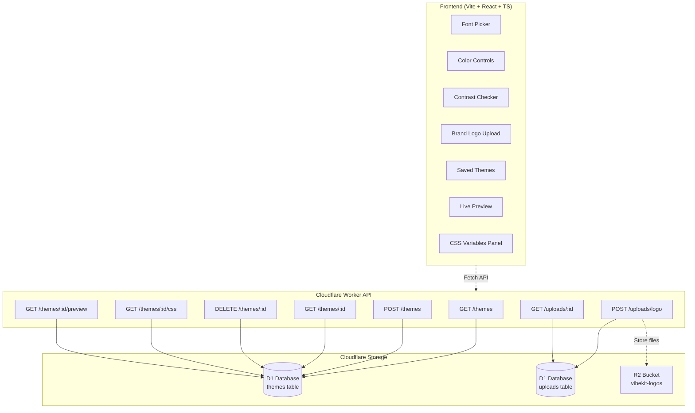

# VibeKit

## About VibeKit

VibeKit is a theme-design toolkit that lets you craft and share UI tokens — **colors**, **typography**, and **spacing** — with a live preview and a shareable CSS endpoint you can drop into any frontend. The app includes a **Google Fonts picker**, **contrast checker (WCAG)**, and a **public preview** page.

## Inspiration

Explore these helpful color design tools that complement VibeKit's functionality:

- **[Coolors Visualizer](https://coolors.co/visualizer/880d1e-dd2d4a-f26a8d-f49cbb-cbeef3)** - Visualize color palettes in real UI components
- **[Coolors Contrast Checker](https://coolors.co/contrast-checker/112a46-acc8e5)** - Test color combinations for WCAG compliance
- **[Mobile Palette Generator](https://mobilepalette.colorion.co/)** - Generate mobile-optimized color schemes
- **[Adobe Color Wheel](https://color.adobe.com/create/color-wheel)** - Explore color relationships and harmonies

## Project Origins

> This was a Design Project for **Girls Develop It: Fearless UX: Unleash Your Creative Potential** workshop, exploring "vibe-coding" methodology I learned from [**Piyush Acharya**](https://github.com/VerisimilitudeX) at **Git Merge 2025**. The project was built in collaboration with [**Krystina Bradley**](https://github.com/kscott2016), who helped shape the user-empathy work, journey mapping, and prototyping. This project was coded in conjunction with **ChatGPT** and **GitHub Copilot**. – Cloudflare Monorepo (Pages + Worker)

### Highlights

- **Inline Live Preview (editor):** See changes instantly on the main page driven by your neutral tokens.
- **Google Fonts:** Pick separate **Header** and **Paragraph** families and weights. Optional full catalog + search via `VITE_GF_API_KEY`.
- **Color Tokens:** Neutral, Primary, Secondary, Tertiary, Danger, Warning, Caution, Success. All exported as CSS variables.
- **Contrast Checker:** Quick AA/AAA checks for key pairs.
- **Palette Generator:** Get triadic/analogous/complementary suggestions from a seed color and apply with one click.
- **Logos:** **upload your own** (PNG/SVG/JPEG/WebP) — stored in **R2** and served via `/api/assets/*`.
- **Shareable:** `/api/themes/{id}.css` (1‑day cache) and `/api/themes/{id}/preview` (5‑min cache).
- **Docs/FAQ:** Available at `#/docs` inside the app.

### Tools & Technologies

**Frontend**

- **Vite** - Fast build tool and dev server
- **React 18** - UI framework with TypeScript
- **CSS Variables** - Dynamic theming system

**Backend**

- **Cloudflare Workers** - Edge compute platform
- **D1 Database** - Serverless SQLite database
- **R2 Storage** - Object storage for uploaded assets

**Development**

- **TypeScript** - Type-safe development
- **ESLint** - Code linting and formatting
- **Wrangler** - Cloudflare development CLI

**Design**

- **Figma** - UI/UX design and prototyping

**AI Tools**

- **ChatGPT** - Code generation and problem solving
- **GitHub Copilot** - AI pair programming

### Future Opportunities

- Figma integration — export downloadable styles/tokens file
- Comments — per-theme threaded notes visible to collaborators
- Custom fonts — allow user-uploaded fonts in addition to Google Fonts
- Import from CSS tokens / Design Tokens JSON

## Architecture

## License

This project is licensed under a **View-Only License** — see the [LICENSE](./LICENSE) file for details.
