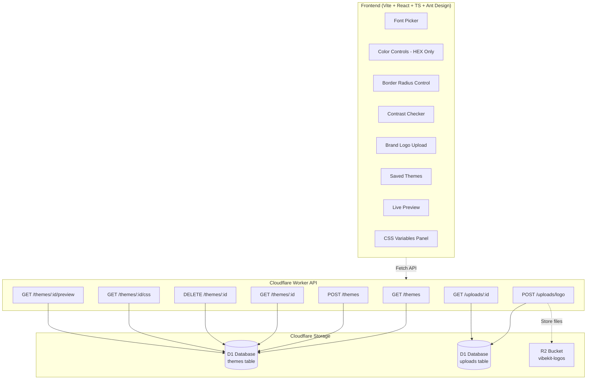

# VibeKit

## About VibeKit

VibeKit is a theme-design toolkit that lets you craft and share UI tokens — **colors**, **typography**, and **spacing** — with a live preview and a shareable CSS endpoint you can drop into any frontend. The app includes a **Google Fonts picker**, **contrast checker (WCAG)**, and a **public preview** page.

## Inspiration

Explore these helpful color design tools that complement VibeKit's functionality:

- **[Coolors Visualizer](https://coolors.co/visualizer/880d1e-dd2d4a-f26a8d-f49cbb-cbeef3)** - Visualize color palettes in real UI components
- **[Coolors Contrast Checker](https://coolors.co/contrast-checker/112a46-acc8e5)** - Test color combinations for WCAG compliance
- **[Mobile Palette Generator](https://mobilepalette.colorion.co/)** - Generate mobile-optimized color schemes
- **[Adobe Color Wheel](https://color.adobe.com/create/color-wheel)** - Explore color relationships and harmonies

## Project Origins

> This was a Design Project for **Girls Develop It: Fearless UX: Unleash Your Creative Potential** workshop, exploring "vibe-coding" methodology I learned from [**Piyush Acharya**](https://github.com/VerisimilitudeX) at **Git Merge 2025**. The project was built in collaboration with [**Krystina Bradley**](https://github.com/kscott2016), who helped shape the user-empathy work, journey mapping, and prototyping. This project was coded in conjunction with **ChatGPT** and **GitHub Copilot**. – Cloudflare Monorepo (Pages + Worker)

## Design Documentation

### 🎨 Figma Design Files

- **[VibeKit Design System](https://www.figma.com/design/wpXKuArJk5VSirui5fZzyi/VibeKit?node-id=0-1&t=6y1SZvfkssgYviG3-1)** - Complete UI/UX designs, component library, and interactive prototypes

### 📋 UX Research & Documentation

- **[Empathy Map](frontend/public/pdf/Empathy%20Map.pdf)** - User research insights and emotional journey mapping to understand target user needs and pain points
- **[User Journey Map](frontend/public/pdf/Journey%20Map.pdf)** - End-to-end user experience flow from discovery to theme implementation and sharing
- **[UX Features Analysis](frontend/public/pdf/UX%20Features.pdf)** - Detailed feature specifications, user stories, and interaction design documentation
- **[Prototype Documentation](frontend/public/pdf/Prototype.pdf)** - Design iteration process, wireframe evolution, and prototype testing results

### Features & Components

**🎨 Color System**

- **HEX-only format** for consistency and performance across all color tokens
- **8 semantic colors:** Neutral (Light/Dark), Primary, Secondary, Tertiary, Danger, Warning, Caution, Success
- **Palette Generator:** Triadic/analogous/complementary suggestions from seed colors with one-click application
- **Contrast Checker:** WCAG AA/AAA compliance validation with real-time accessibility scoring

**🔄 Border Radius Control**

- **Interactive slider (0-25px)** with instant preview on chips, buttons, and containers
- **CSS variable integration** (`--border-radius`) with live theme updates
- **Logo preservation** - brand assets unaffected by border radius theming

**🔤 Typography Management**

- **Google Fonts integration** with separate Header/Paragraph font selection
- **Advanced controls:** Weight, style, line height, and letter spacing options
- **Optional full catalog** search via `VITE_GF_API_KEY` environment variable

**🖼️ Brand Assets**

- **Multi-format support:** PNG, SVG, JPEG, WebP uploads stored in Cloudflare R2
- **Reliable hosting** with automatic fallback placeholders and error handling

**💾 Theme Management**

- **Full CRUD operations** with D1 database persistence and theme duplication
- **Shareable exports:** `/themes/{id}.css` (cached) and `/themes/{id}/preview` demo pages
- **Development-friendly:** Dynamic API detection for local vs production environments

**⚡ Live Preview System**

- **Real-time updates** using direct theme values without CSS injection dependencies
- **CSS Variables Panel** with organized grouping and copy-to-clipboard functionality
- **Instant feedback** across all UI components and preview elements

## 🛠️ Tech Stack & Tools

<table>
<tr>
<td>

### 🌐 Frontend

- ⚡ **Vite** — Lightning-fast dev server
- ⚛️ **React 18** — Modern UI framework + TypeScript
- 🐜 **Ant Design** — Enterprise-class UI components
- 🎨 **CSS Variables** — Dynamic theming engine

</td>
<td>

### ☁️ Backend

- 🔧 **Cloudflare Workers** — Serverless edge compute
- 💾 **D1 Database** — Global SQLite at the edge
- 📦 **R2 Storage** — Object storage for assets

</td>
</tr>
<tr>
<td>

### 👨‍💻 Development

- 📘 **TypeScript** — Type-safe development
- 🔍 **ESLint** — Code quality & formatting
- 🔨 **Wrangler** — Cloudflare dev toolkit

</td>
<td>

### 🎨 Design & UX

- ✏️ **Sketched Wireframes** — Concept & user flows
- 🎯 **Canva** — Journey & empathy mapping
- 🔷 **Figma** — UI/UX design & prototyping

</td>
</tr>
<tr>
<td colspan="2">

### 🤖 AI-Powered Development

- 💬 **ChatGPT** — Code generation & problem solving
- 🧠 **GitHub Copilot** — AI pair programming & suggestions

</td>
</tr>
</table>

### Future Opportunities

- Figma integration — export downloadable styles/tokens file
- Comments — per-theme threaded notes visible to collaborators
- Custom fonts — allow user-uploaded fonts in addition to Google Fonts
- Import from CSS tokens / Design Tokens JSON

## Architecture

## License

This project is licensed under a **View-Only License** — see the [LICENSE](./LICENSE) file for details.
