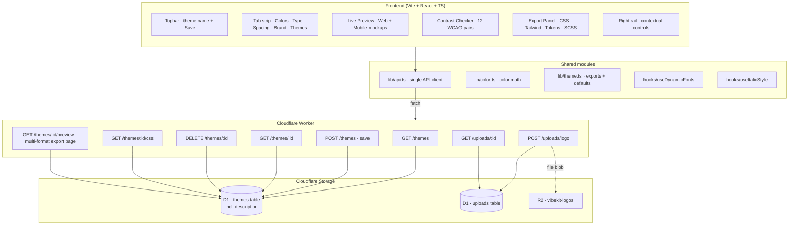

# VibeKit

## About VibeKit

VibeKit is a theme-design toolkit that lets you craft and share UI tokens — **colors**, **typography**, and **spacing** — with a live preview, accessibility validation, and **four export formats**: CSS variables, Tailwind config, W3C Design Tokens JSON, and SCSS variables. Themes get a public shareable preview page and a direct CSS endpoint you can `<link>` into any frontend.

Built around a five-color brand identity, a custom design language, and a clean editor with a top tab strip + 65/35 workspace split.

## Project Origins

> **VibeKit** emerged from the **Girls Develop It: Fearless UX: Unleash Your Creative Potential** workshop, where I applied the "vibe-coding" methodology I had learned from [**Piyush Acharya**](https://github.com/VerisimilitudeX) at **Git Merge 2025**.
>
> Built in collaboration with [**Krystina Bradley**](https://github.com/kscott2016), who contributed invaluable user-empathy research, journey mapping, and prototyping expertise. The technical implementation was developed with AI pair-programming, showcasing modern AI-assisted development workflows.

## Visual Identity

VibeKit has its own designed brand system — five vibrant colors (sun, flame, hot pink, violet, azure), a custom wave-mark logo, Plus Jakarta Sans for UI and JetBrains Mono for code. See **[docs/brand-system.md](./docs/brand-system.md)** for the full reference: color jobs, logo rules, typography hierarchy, voice, and design decisions.

## Features

### 🎨 Colors

- **10 semantic tokens** organized as Neutrals (Light · Mid · Dark), Brand (Primary · Secondary · Tertiary), and Status (Success · Warning · Caution · Danger)
- **HEX-only** for consistency
- **Automatic naming** of every color via [The Color API](https://www.thecolorapi.com/)
- **Palette generator** — pick a base color, choose a scheme (Monochromatic, Analogous, Complementary, Triadic), and optionally derive Neutrals and Status colors from it. Derived neutrals pull toward white and near-black with a subtle brand tint, so they're usable out of the box.

### 🔤 Typography

- **Two-font system** — pick a Header font and a Paragraph font independently from Google Fonts
- **Per-font controls** for weight, italic, line-height, and letter-spacing
- **Modular type scale** — set a base size (12-18px) and a scale ratio (Minor 2nd through Perfect 5th) to mathematically derive h1-h6
- **Live preview** in the FontPicker, plus full application across the live preview canvas

### 🔄 Spacing

- **Border radius slider** (0-25px) with one-click impact across every rounded element in your theme

### 🖼️ Brand

- **Logo upload** (PNG, JPG, SVG, WebP) — stored in Cloudflare R2 with a public URL
- **Theme description** (max 200 chars) — surfaces on the saved themes list and the public preview page

### ♿ Contrast Checker (WCAG)

- **12 meaningful color pairings** validated against WCAG AA / AAA standards
- **At-a-glance pass/fail** with the exact contrast ratio in JetBrains Mono
- **Responsive grid** — 2-col on narrow screens, up to 4-col on wide

### 🚀 Live Preview

- **Web app mockup** — full browser-framed dashboard with top nav, sidebar, metric cards, and a status table using your theme tokens
- **Mobile app mockup** — phone-framed finance home screen with a themed balance card, secondary/tertiary stat tiles, recent activity, and a primary-colored bottom nav indicator
- **View toggle** — Both / Web / Mobile, responsive (stacks vertically below 1180px viewport)
- **Updates as you edit** — every color, font, weight, line-height, letter-spacing, and border-radius change is reflected instantly

### 📦 Multi-format Exports

In-app **Export panel** and on the public **preview page**, with one-click copy:

- **CSS variables** — `:root { --color-primary: ...; }` for any project
- **Tailwind config** — `theme.extend` snippet ready to paste into `tailwind.config.js`
- **W3C Design Tokens JSON** — the emerging standard, consumable by Style Dictionary, Figma Tokens, etc.
- **SCSS variables** — `$color-primary: ...;` for Sass projects

Plus a direct CSS URL at `/themes/{id}/css` that you can `<link>` straight into a page.

### 💾 Saved Themes

- **Full CRUD** — save, load, duplicate, delete, with relative timestamps ("2 days ago")
- **Type-to-confirm** delete pattern (GitHub-style) — no passwords, no secrets, hard to mis-click
- **Public preview page** at `/themes/{id}/preview` with hero, mockups, color tokens, type scale, components, and all four export formats with copy buttons

### 📚 In-app Docs

A `/docs` page covering the editor, the five tabs, the canvas, saving, exporting, and how to consume the tokens in your own project.

## 🛠️ Tech Stack

### 🌐 Frontend

- ⚡ **Vite** — dev server and build tool
- ⚛️ **React 18** + TypeScript
- 🎨 **Custom design system** (`.vk-*` classes) — Plus Jakarta Sans, JetBrains Mono, cream-and-ink color language
- 🐜 **Ant Design** — used selectively for the color picker and a few form controls; most UI is custom
- 🛤️ **React Router** — `/` (editor) + `/docs`

### ☁️ Backend

- 🔧 **Cloudflare Workers** — single-file Worker handling all routes
- 💾 **D1** — SQLite at the edge for themes + uploads metadata
- 📦 **R2** — logo file storage
- 🔨 **Wrangler 4** — Cloudflare dev toolkit

### 🌐 External APIs

- 🎨 **[The Color API](https://www.thecolorapi.com/)** — human-readable color names
- 🔤 **[Google Fonts](https://developers.google.com/fonts)** — web font catalog and loading

## Architecture


```mermaid
flowchart TB
  subgraph Frontend["Frontend (Vite + React + TS)"]
    direction TB
    F1[Topbar · theme name + Save]
    F2[Tab strip · Colors · Type · Spacing · Brand · Themes]
    F3[Live Preview · Web + Mobile mockups]
    F4[Contrast Checker · 12 WCAG pairs]
    F5[Export Panel · CSS · Tailwind · Tokens · SCSS]
    F6[Right rail · contextual controls]
  end

  subgraph Lib["Shared modules"]
    L1[lib/api.ts · single API client]
    L2[lib/color.ts · color math]
    L3[lib/theme.ts · exports + defaults]
    L4[hooks/useDynamicFonts]
    L5[hooks/useItalicStyle]
  end

  subgraph Worker["Cloudflare Worker"]
    W1[GET /themes]
    W2[POST /themes · save]
    W3[GET /themes/:id]
    W4[DELETE /themes/:id]
    W5[GET /themes/:id/css]
    W6[GET /themes/:id/preview · multi-format export page]
    W7[POST /uploads/logo]
    W8[GET /uploads/:id]
  end

  subgraph Storage["Cloudflare Storage"]
    S1[(D1 · themes table<br/>incl. description)]
    S2[(D1 · uploads table)]
    S3[R2 · vibekit-logos]
  end

  Frontend --> L1
  L1 -->|fetch| Worker
  W1 --> S1
  W2 --> S1
  W3 --> S1
  W4 --> S1
  W5 --> S1
  W6 --> S1
  W7 --> S2
  W7 -.->|file blob| S3
  W8 --> S2
```

## Getting Started

```bash
# Frontend
cd frontend
npm install
npm run dev          # http://localhost:5173

# Worker (in another terminal)
cd api
npm install
npm run d1:migrate   # apply database migrations locally
npm run dev          # http://127.0.0.1:8787

# Deploy
npm run deploy                  # publish Worker to Cloudflare
npm run d1:migrate:remote       # apply migrations to production D1
```

Optional env vars in `frontend/.env.local`:

```
VITE_GF_API_KEY=...     # unlocks the full Google Fonts catalog (otherwise a curated list)
VITE_API_BASE=...       # override the API base URL
```

## Future Opportunities

- 🌗 **Dark mode** — second color set per theme, mode toggle in the editor, `[data-theme="dark"]` block in exports
- 🎨 **Color blindness simulation** — Deuteranopia / Protanopia / Tritanopia preview alongside the contrast checker
- 📥 **Import from Coolors / hex list / Design Tokens JSON** — reverse direction of the exports
- 🎁 **Starter templates** — fork from curated themes (Editorial, SaaS, Playful, Bold, Mono)
- ✏️ **Custom font uploads** — alternative to Google Fonts only
- 💬 **Per-theme comments** for collaborative review
- 🎨 **Figma plugin** for round-tripping tokens

## Design Documentation

### 🎨 Figma Design Files

- **[VibeKit Design System](https://www.figma.com/design/wpXKuArJk5VSirui5fZzyi/VibeKit?node-id=0-1&t=6y1SZvfkssgYviG3-1)** — Component library and prototypes

### 📋 UX Research

- **[Empathy Map](frontend/public/pdf/Empathy%20Map.pdf)** — User research insights and emotional journey mapping
- **[User Journey Map](frontend/public/pdf/Journey%20Map.pdf)** — End-to-end UX flow
- **[UX Features Analysis](frontend/public/pdf/UX%20Features.pdf)** — Feature specs and user stories
- **[Prototype Documentation](frontend/public/pdf/Prototype.pdf)** — Design iteration and prototype testing

### 🌈 Inspiration

- **[Coolors Visualizer](https://coolors.co/visualizer/880d1e-dd2d4a-f26a8d-f49cbb-cbeef3)** — Palette previews in real UI
- **[Coolors Contrast Checker](https://coolors.co/contrast-checker/112a46-acc8e5)** — WCAG validation
- **[Mobile Palette Generator](https://mobilepalette.colorion.co/)** — Mobile-optimized palettes
- **[Adobe Color Wheel](https://color.adobe.com/create/color-wheel)** — Color relationships and harmonies

## License

This project is licensed under a **View-Only License** — see the [LICENSE](./LICENSE) file for details.
